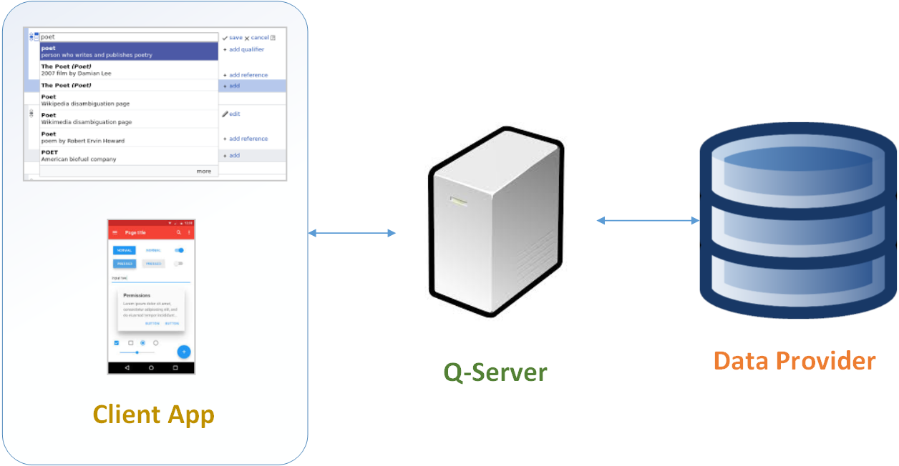

# QL Server
Gives API for back-end server connectivity; MS SQL Server connectivity provided in this sample.

# What is it?
QL Server is a backend server which supports queries, like [GraphQL](http://graphql.org), but much simpler to understand, as the queries are JSON objects  with a specific syntax, which is documented below.



# Why do we need it?
I was very much interested in GraphQL after reading the documentation. Then, since it is a specification, the implementation has to be created for backend systems. Not saying that it is difficult, I wanted a simpler interface to my database.

The objective achieved is that my client apps can pass query as JSON object, and retrieve the data as JSON. As the query is in already known format, I could skip the JSON-like query language in GraphQL.

# Is it usable?
Yes. To demonstrate, included is a client app which connects to the server, which acts as a pipe to my database. In the server app, I've included a query translator to enable querying to MS SQL Server. Although, not all the SQL functions are supported for light weight app development, this can save time and keep 'client-server-database connectivity' complexity low.

This initial SQL Server query translator lets my client code to retrieve data from tables without server adding any weight on it.


# Does it support my database?
Except for MS SQL Server, other connectors need to be developed. But that can be placed as separate endpoint servers, hence minimizing the effort. The basic logic of parsing the JSON query object is already present in sqlserver folder parsers, which are invoked from runSelect.js

# Can I use it for production use?
I'm sure it will be helpful to your product, but until test cases are added, please don't.

# So, what is the JSON query object structure?
There are 4 basic portions:
1. **Configuration for database [Optional]**: You may want to pass the config that your server could use to connect to the data provider. In the sample client app, I've passed the configuration object that is used by the SQL Server connection library msnodesqlv8. This library was chosen because it let's the server authenticate itself to the database using Windows Authentication. The SQL connector written here requires this only till the database connection is established, and ignores after that.

2. **Data Provider / Database Name [Required]**: This is the database name in the sample app.

3. **Select Query [Optional]**: In this array, you place your queries. Return value will be array or results.

4. **Count Query [Optional]**: In this array, you place your queries which will return array of counted entries matching the filter.

Example:

```javascript
{
    // Configuration for database connection. Documentation: https://github.com/coopernurse/node-pool
    config: {
        "server": "localhost",
        "options": {
            // "instanceName": "SQLEXPRESS",
            "trustedConnection": true, // For Windows Authentication
            "encrypt": false // As it is not connecting to SQL Server on cloud
        }
    },

    // Database name
    db: 'ABCD',

    // Queries
    select: [{
          // Sample of a query to get complete data in table / collection

          // Name of table / collection
          employeeTable: { } // It will give me entire collection / table data
      },
      {
          // Sample query to return employee_id and employee_name of table 'employeeTable'
          // but limit the output to first two entries.

          // Name of table / collection
          employeeTable: {
              fields: ['employee_id', 'employee_name'], // Column/Field names

              limit: 2 // Limiting factor to first n entries. If omitted, returns all entries
          }
      },

        /*=========================== FILTERING ===========================*/

      {
          // Sample query to return all fields / columns of table 'employeeTable'
          // where employee_id is less than 10000.

          employeeTable: {
              filter: [{
                  'employee_id': {
                      lt: 10000
                  }
              }]
          }
      },
      {
          // Sample of complex query which has many and nested levels of AND/OR condtions.

          employeeTable: {
              fields: ['employee_id', 'employee_name'], // Column / Field names

              // List of conditions that must be applied to the data
              // By default, all the conditions are ANDed.
              filter: [
                  {
                      // The conditions that must be explicitly ORed, go into this collection.
                      or: [{
                              // For nesting AND conditions inside OR, use "all" filter.
                              // The depth of AND+OR nesting can be increased further, as per need.
                              all: [{
                                      'employee_id': {
                                          gt: 123000 // Greater than.
                                      }
                                  },
                                  {
                                      'employee_name': {
                                          like: '"*jane*"' // Pattern matching for string / text.
                                      },
                                  }
                              ]
                          },
                          {
                              'employee_id': {
                                  lt: 5000 // Less than.
                              }
                          },
                          {
                              'employee_id': {
                                  gt: 8000 // Greater than.
                              }
                          }
                      ]
                  },
                  {
                      'employee_name': {
                          eq: 'doe' // Equality match.
                      },
                  }
              ],
          }
       },

        /*=========================== SORTING ===========================*/

       {
            // Sample query to return employee_id and employee_name of table 'employeeTable'

            employeeTable: {
                fields: ['employee_id', 'employee_name'], // Column/Field names

                // Collection of field names which in that order are used to sort the entries.
                // Default sorting is in ascending order.
                order_by: ['employee_id'] // Order the entries by this field(s)

                // In this sample, the fields that are returned, are: employee_id, employee_name
           }
       },
       {
            // Sample query to return employee_id and employee_name of table 'employeeTable'

            employeeTable: {
                fields: ['employee_id', 'employee_name'], // Column/Field names

                // Another way to sort the entries.
                // Default sorting is in ascending order.

                // Order the entries by this field(s)
                order_by: [{
                    field: 'employee_age'
                }]

                // Note: If the fields specified in 'order_by' array are not in 'fields' array,
                // the returned fields will contain them. In this sample, the fields that are
                // returned, are: employee_id, employee_name, employee_age
           }
       },
       {
            // Another way to sort the entries.

            employeeTable: {

                // Order the entries by this field(s)
                order_by: [{
                    order: 'asc', // Explicitly specified ascending order. Values allowed: 'asc' and 'desc'
                    field: 'employee_age'
                }]
           }
       },
       {
            // A mixed way to sort the entries.

            employeeTable: {

                // Order the entries by these fields
                order_by: [
                    'country_name', // default order ascending
                    'business_unit', // default order ascending
                    {
                        order: 'desc', // Explicitly specified descending order. Values allowed: 'asc' and 'desc'
                        field: 'employee_age'
                    }
                ]
           }
       },
    ],

    // Queries to count entries macthing the filters.
    // Only 'filter' is acknowledged in the object, everything else is ignored.
    count: [{
        // Sample query to provide count of all entries in 'employeeTable'
        // where employee_id less than 10000.

        employeeTable: {
            filter: [{
                'employee_id': {
                    lt: 10000
                }
            }],
        }
    }]
};
```

# Filter Operators

The supported operators are:
1. **eq** - Equality check
2. **not_eq** - Inequality check
3. **in** - Check for object in a collection of given inputs
4. **not** - Check for object not in a collection of given inputs
5. **like** - Pattern matching, only for strings
6. **not_like** - Pattern matching, only for strings, negated
7. **gt** - Greater than
8. **lt** - Less than

If you observe, there is no 'greater than or equal to' and 'less than or equal to' operator. To achieve the same effect, set 'gt' / 'lt' and 'eq'. So, they are combination of two operators.

# Filtered Data by SQL Server Connector
Specifically in this SQL connector, if all the rows asked to be returned from the table, it will be so. But if there are conditional clauses added, then 'distinct' entries will be returned.

# Returned Data Format
If I run this set of queries,
```javascript
{
    config: {
        "server": "localhost",
        "options": {
            "instanceName": "SQLEXPRESS",
            "trustedConnection": true,
            "encrypt": false
        }
    },

    db: 'ABCD',

    select: [{
          employeeTable: {
              fields: ['employee_id', 'employee_name'],
              limit: 2
          }
      }
    ],

    count: [{
        employeeTable: {
            filter: [{
                'employee_dob_year': {
                    lt: 1800
                }
            }],
        }
    }]
};
```

then, this is how my result will look like:
```json
{
  "return_code": 0,
  "value": {
    "select": [
      {
        "tableName": "[ABCD].[dbo].[employeeTable]",
        "records": [
          {
            "employee_id": 1,
            "employee_name": "Wolfgang Amadeus Mozart"
          },
          {
            "employee_id": 2,
            "employee_name": "Ludwig van Beethoven"
          }
        ]
      }
    ],
    "count": [
      {
        "tableName": "[ABCD].[dbo].[employeeTable]",
        "records": [
          {
            "count": 10
          }
        ]
      }
    ]
  }
}
```

*return_code* being 0 is success of the operation. If it is negative, then an error has happened, and the absolute of return_code is the error number.


Here is a sample result, when the data provider could not be connected, SQL Server in this case:
```json
{
  "return_code": -200,
  "text": "[Microsoft][SQL Server Native Client 11.0]SQL Server Network Interfaces: Error Locating Server/Instance Specified [xFFFFFFFF]. ",
  "value": {
    "code": -1,
    "originalError": {
      "sqlstate": "08001",
      "code": -1
    },
    "name": "ConnectionError"
  }
}
```

To note:
1. *return_code* is -ve.
2. 200 is the error code.
3. In *value* field, *originalError* contains information about the SQL Server error.
4. In *value* field, *name* states the type of error.


# Caveats
There are a few, which hopefully will be fixed. Let me mention a few:
1. *dbo* schema name is assumed and used in queries. It may be fixed by letting client state the schema. However, it may be applicable to SQL server, and not other data providers. So, it should be made optional.
2. If the server connects to the data provider, it keep the channel open. In SQL Server case, this is how it has been implemented. It may not be valid issue for other data providers, which don't work on persistent channels.
3. The server has not been designed to self-heal if there is connectivity problem, in the very first request. This behavior affects the client, which, when after correcting bad configuration, requests server, a connection to data again - the server doesn't respond in expected manner due to inner errors. This may be fixed later. For now, restart the server manually.


# Bonus
If you are not comfortable writing JSON objects, head over to [Micro Query Language](https://github.com/cnayan/mql), which will build objects for you.
